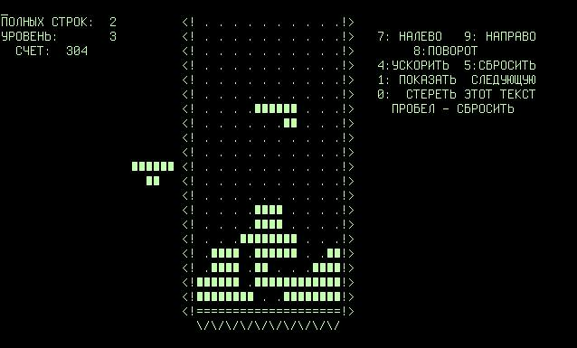

**25/365 Tetris** este probabil unul din cele mai populare jocuri video care au existat vreodată. Acesta a fost creat în anul 1984 de programatorul rus Alexei Pajitnov, iar denumirea jocului provine de la tetra, făcând referire la faptul că toate figurile erau formate din patru pătrăţele, şi tenis, jocul preferat al autorului. Probabil nu există platformă pe care nu a fost portat acest joc, începând de la compiuterele din perioada sovietică, până la telefoane de ultimă generaţie din zilele noastre. Interesant este faptul că iniţial Pajitnov a dăruit jocul unui importator de soft din Ungaria, iar acesta a hotărât că poate vinde liber licenţa unor companii precum Mirrorsoft, care mai apoi vând acest drept companiei Atari, astfel autorul jocului începe să primească comision pentru produsul său doar peste 14 ani, atunci când termenul licenţei iniţiale a expirat.

