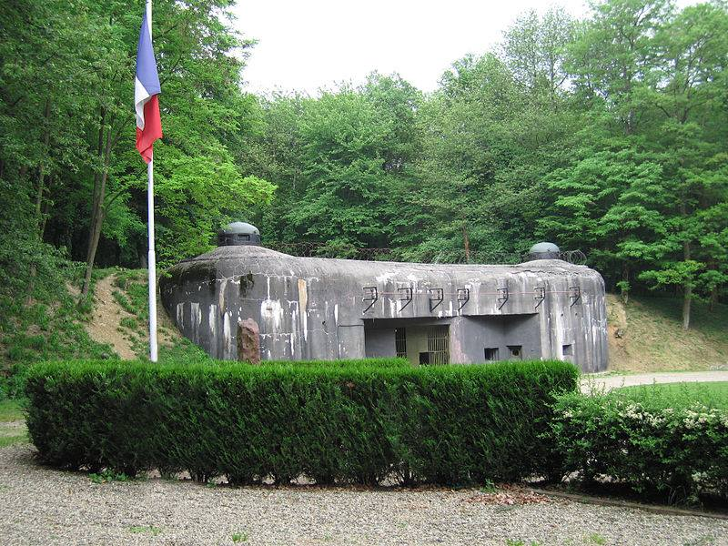

**26/365** Istoria cunoaşte multe decizii greşite, iar **Linia Maginot** e doar una din ele. Construită şi modernizată de-a lungul hotarului dintre Franţa şi Germania între anii 1929 şi 1940, aceasta reprezintă un şir de fortificaţii de beton, obstacole antitanc, cazemate, mitraliere, şi alte elemente de apărare. Bazându-se pe experienţa din Primul Război Mondial, aceştia speră să fie pregătiţi de un eventual atac, mai ales din partea Germaniei. Experţii militari au lăudat construcţia ca fiind una genială, şi totuşi aceasta sa dovedit a fi total ineficientă. După ce au invadat Belgia, au învins armata franceză, aceştia au ocolit Linia Maginot prin pădurile din Ardeni, unde linia era mai slabă, deoarece nu se credea că germanii ar fi putut ataca prin acel loc, şi au cucerit Franţa în doar câteva zile. Astfel, cheltuielile enorme de cca trei miliarde de franci, putea fi investite în tancuri şi avioane, arme de luptă care şi-au arătat deja eficacitatea în Primul Război Mondial. După al Doilea Război Mondial, francezii au modificat o mare parte din linie, dar odată ce Franţa a devenit putere nucleară, Linia Maginot şi-a pierdut în totalitate valoarea, iar în zilele noastre, diferite segmente sunt folosite ca muzeu or ca ferme pentru ciuperci, pivniţe pentru vinuri şi chiar cluburi de distracţie.

