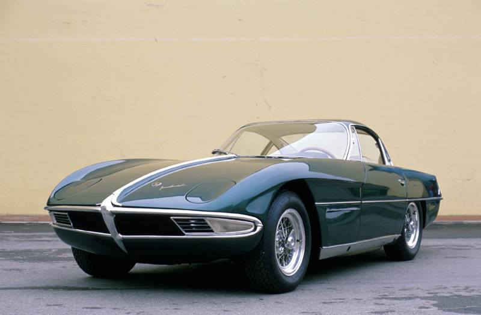

**27/365** Dacă sunteţi şeful unei companii înfloritoare, a-ţi face bine să nu răspundeţi cu răutate unui client, altfel, v-aţi putea trezi cu un concurent de temut. Şeful companiei Lamborghini Trattori, Ferruccio Lamborghini, era deţinătorul unui Ferrari 250GT. Acesta a mers înr-o zi la Enzo Ferrari pentru a se plângă de calitatea proastă a ambreajului, iar Enzo, i-a răspuns cu răutate să plece şi să conducă tractoare, pentru că nu-l duce capul să conducă şi maşini de sport. Ferruccio s-a întors la uzina sa, a desfăcut piesa defectă a maşinii sale şi şi-a dat seama că aceasta este produsă de aceeaşi firmă care produce ambreaje şi pentru tractoarele sale. Furios pe răspunsul arogant al lui Enzo, acesta îşi promite să-l bată prin a construi o maşină sport performantă. Aşa apare ideea unei maşini Lamborghini. Primul prototip al Lamborghini 350 GTV a fost demonstrat publicului în 1963, iar în anul 1964 deja era lansat în serie. Chiar dacă pe parcursul existenţei sale, din diferite motive, precum criza petrolului din anii '70, loveşte cumva în companie, totuşi, nu mai este secret pentru nimeni că Lamborghini produce unele din cele mai de succes maşini sportive, care sunt dorite de milioane de oameni.

