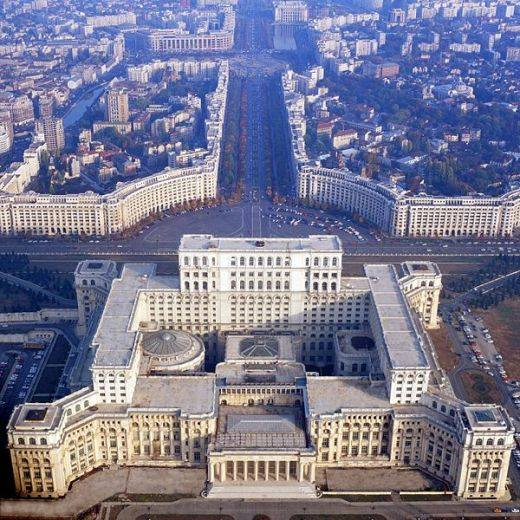

**28/365** Una din cele mai mari clădiri administrative din lume se află în România şi este cunoscută sub numele de Casa Poporului. În 1977, după cutremurul devastator care a distrus o parte a Bucureştiului, Nicolae Ceauşescu a ordonat reconstruirea şi reorganizarea oraşului, lansând un concurs naţional la care a participat şi tânăra de 28 de ani Anca Petrescu, care devine câştigătoare şi după proiectul căruia au început construcţiile. Clădirea are o înălţime de 86m şi un subsol adânc de 92m. şi respectiv 270m pe 240m. Atât la suprafaţă cât şi la subsol are câte 9 niveluri. Suprafaţa totală a clădirii este de 330.000m2, a doua ca mărime din lume, după clădirea Pentagonului. Construcţia propriu zisă a început la 25 iunie 1984, şi a durat 13 ani, până în 1997, iar costurile se ridică la trei miliarde de dolari. Totuşi, costurile au fost minimizate datorită faptului că lucrările s-au efectuat inclusiv cu munca forţată şi grauită a militarilor. Totodată, construcţia a cauzat şi demolarea a peste 7km2 din vechiul centru al capitale şi relocaţia a peste 40.000 de persoane. Dintre clădirile demolate, se numărau şi unele edificii importante aşa ca Mănăstirea Văcăreşti ori Stadionul Republican. Clădirea are aproximativ 1000 de încăperi, dintre care 400 de birouri, 30 de săli, câteva restaurante, biblioteci, două parcări subterane şi o sală de concerte. Pentru constrcuţie au fost folosite cca 1.000.000m2 de marmură, 2.000.000 tone de nisip, 900.000m3 de esenţă de lemn, 200.000m3 de sticlă şi altele. Deşi este un edificiu atât de măreţ şi important, totuşi este urât de mulţi oameni, din motiv că acesta le aduce aminte de perioada conducerii dictatorului Ceaşusecu.

