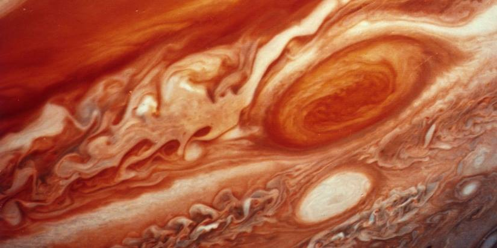

**29/365** În timp ce furtunile de pe planeta noastră face ravagii, furtunile întâlnite pe planeta Jupiter, pur şi simplu ar şterge întreaga planetă Pământ din Univers. Sper exemplu, Marea Pată Roşie de pe Jupiter este o furtună care potrivit cercetătorilor durează de mai bine de 180 de ani, şi iniţial ar fi avut un diametru de peste 40.000km, adică mai bine de mărimea a trei planete Pământ. Totuşi aceasta se micşorează, şi acum ar avea "doar" în jur de 20.000km, iar oamenii de ştiinţă nu pot prognoza cât va dura furtuna.

