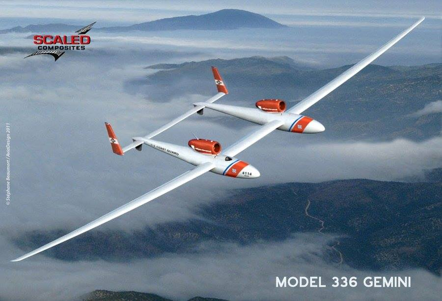

**3/365** Cel mai lung zbor cu avionul, fără escală şi fără realimentare a fost efectuat în februarie 2006, pe o distanţă de 41.467km timp de 76 ore şi 45 minute. Recordul îi aparţine pilotului James Stephen Fossett care a folosit un avion reactiv special, şi anume Virgin Atlantic GlobalFlyer.

