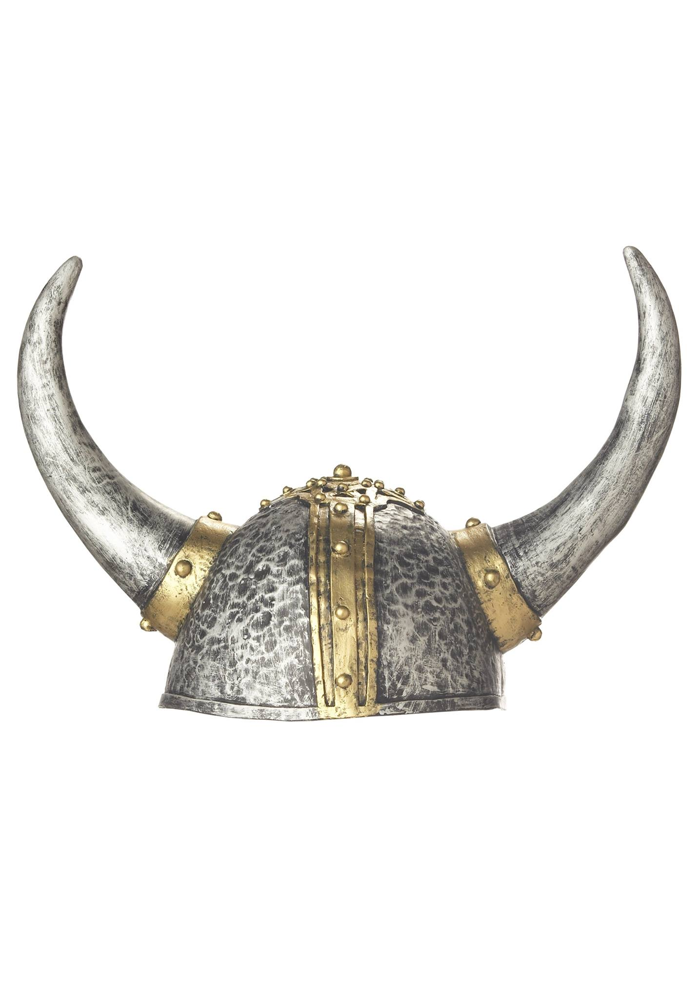

**30/365** Deşi s-ar părea că în era internetului, toate miturile vechi ar trebui pur şi simplu să dispară într-un timp foarte scurt, iar altele noi nici să nu apară, datorită avalanşei de informaţie şi uşurinţa cu care este accesată aceasta, lucrurile totuşi nu stau deloc aşa. Spre exemplu, mitul despre coifurile cu coarne ale vikingilor, este extrem de răspândit în jocurile video, filme, desene animate, etc. În realitate însă, vikingii nu au purtat niciodată astfel de coifuri. Aşezările acestui popor au fost cercetate temeinic de-a lungul timpului, însă nu a fost găsit niciun astfel de coif cu coarne de bou. După cât se ştie, la celţi şi la unele popoare germanice, preoţii purtau podoabe pentru cap care aveau şi coarne, dar care totuşi arătau diferit de acelea care le sunt atribuite vikingilor. Câţiva anitici au descris popoarele nordice, scriind că se împodobeau cu capete de sălbătăciuni în chip de coifuri, astfel, ar fi putut avea şi coarne. Didor scria că galii purtau coifuri cu aripioare, coarne sau chiar animale întregi, iar Herodot menţiona că unele triburi trace aveau podoabe de acest tip. Totuşi, puţin probabil ca acestea să fi fost purtate în lupte, din cauza că aveau să îngreuneze mişcările, astfel, acestea mai degrabă erau purtate la diferite ceremonii. Artiştii care aparţineau curentului romantic au fost primii care le-au ataşat coarne vikingilor, încercând să reînvie temele şi tradiţiile Greciei şi Romei antice, căutând să exploreze teme noi, astfel ajungând să interpreteze la propriu scrierile anticilor.

