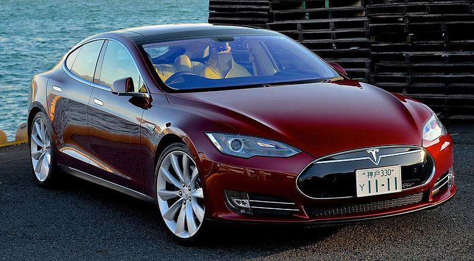

**31/365** În ultimul timp automobilele electrice sunt din ce în ce mai întrebate şi multe companii se străduie să-şi creeze propriile modele după succesul celor de la Tesla. Totuşi, poate părea straniu, dar istoria automobilelor electrice are o vechime de aproape 200 de ani. În anul 1828, maghiarul Ányos Jedlik realizează primul motor electric, iar în 1835 doi olandezi creează un automobil electric în miniatură cu baterii nereîncărcabile, iar trei ani mai târziu, scoțianul Robert Davidson construiește o locomotivă electrică ce atinge 6 km/h. În anul 1899, belgianul pe nume Camille Jenatzy creează o maşină electrică aerodinamică, de forma unui obuz, și reuşeşte să depăşească distanţa de 100km. Totuşi, din cauza problemelor cu reîncărcarea bateriilor, care existau la acel moment, constructorii au renunţat la acest tip de motor, mai ales că deja se inventaseră motorul cu ardere internă al cărui combustibil era din abundenţă şi uşor de obţinut. În anii \`60 şi \`70 ai secolului 20, după problemele poluării mediului înconjurător şi criza petrolului, automobilele electrice sunt iar în centrul atenţiei, pentru puţin timp, până când problema crizei petrolului dispare plus caracteristicile destul de joase ale automobilelor cu motor electric. Acum, ultimii câţiva ani, problema petrolului destul de scump şi a poluării continue a atmosferei, se pare că poate fi începutul sfârşitului erei automobilelor cu motoare cu ardere internă. Tot mai multe companii investesc în maşinile electrice, iar rezultatele nu întârzie să apară. Spre exemplu, recordul distanţei parcurse pe o singură încărcătură a unui automobil Tesla, este de 728km. Pe lângă aceasta, maşinile cu motor electric au mai puţine piese, şi deci, e mai ieftină la întreţinere - lispa filtrelor, uleiului, etc.

