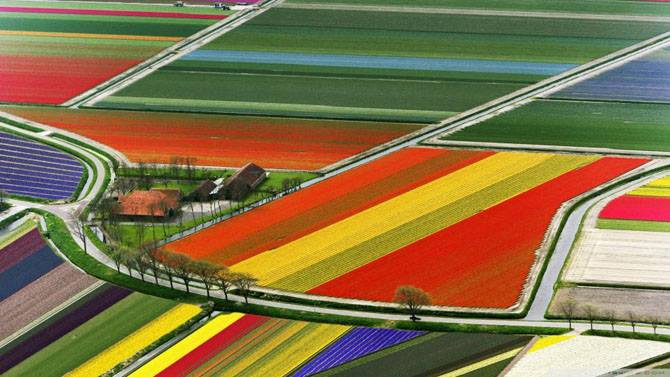

**32/365** Deşi este cunoscută drept ţara lalelelor, Olanda nu este ţara de origine ale acestor flori. De exemplu, în anii 1500, în timpul perioadei de domnire a sultanului Suleiman I, în Imperiul Otoman lalelele au devenit cultivate deoarece îi plăceau foarte mult acestuia, iar în timpul domniei turcului Ahmed al III-lea, laleaua a fost considerată simbolul bogăţiei şi al prestigiului. Însuşi denumirea florii vine dintr-un cuvânt turcesc care înseamnă turban. Chiar şi primul festival al lalelelor a fost organizat în Imperiul Otoman. În anul 1593, Carolus Clusius devenise profesor la universitatea din Leiden, Olanda, şi a înfiinţat acolo o grădină botanică, unde a cultivat inclusiv şi laleaua, care fusese cumpărată din Turcia, iar aceasta s-a adaptat într-atât de bine la clima regiunii, încât s-a răspândit rapid în toată ţara, devenind într-un final simbolul Olandei. Astăzi, Olanda este cel mai important producător şi exportator de flori din Europa şi unul din cei mai importanţi jucători pe piaţa mondială.

