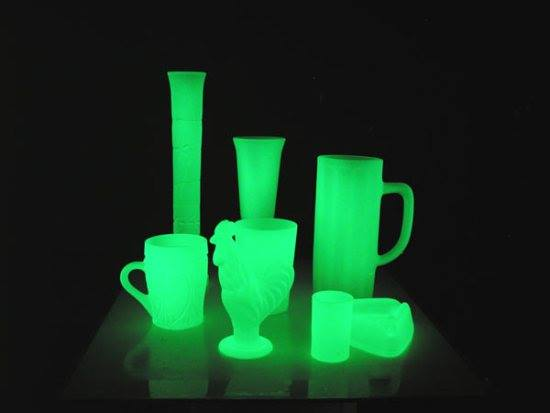

**33/365** Istoria cunoaşte multe descoperiri şi invenţii întâmplătoare sau din greşeală. Şi descoperirea fosforului face parte din această categorie. În anul 1669 alchimistul Hennig Brad era în căutarea pietrei filozofale şi credea că urina e galbenă din motiv că ar putea conţine aur. Astfel, el a încercat să distileze urina pentru obţinerea acestuia, în urma căreia a obţinut un produs alb care lumina la întuneric şi pe care l-a numit foc rece. Fosforul a fost primul element chimic descoperit oficial.

