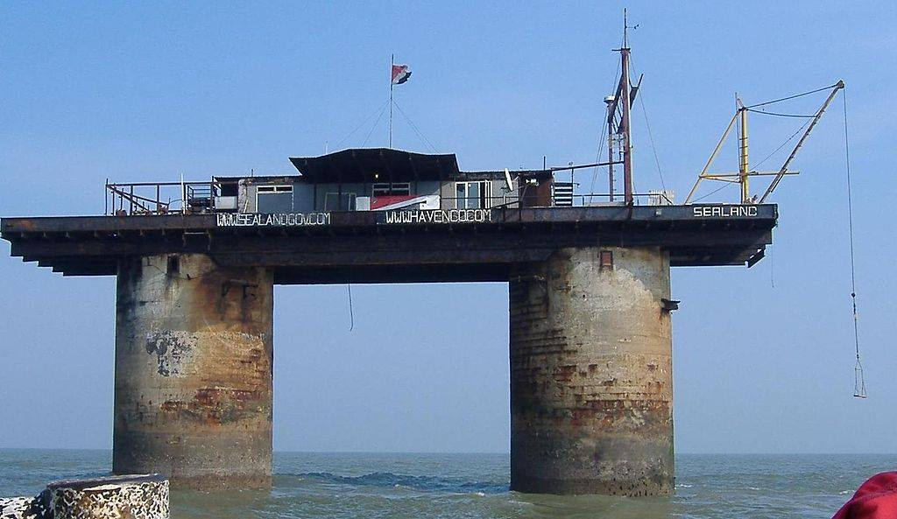

**34/365** Dacă ar fi fost recunoscută pe plan internaţional, **Sealand** probabil ar fi cea mai mică ţară din lume. Pare a fi mai degrabă o glumă, dar teritoriul autoproclamat are o suprafaţă de doar câteva zeci de metri pătraţi şi e înconjurat în totalitate de apele Mării Nordice, aflându-se la 10km distanţă de Marea Britanie. Toată "ţara" încape pe o platformă maritimă care a fost folosită în cel de al doilea război mondial ca structură defensivă şi pe care se şi situiază. Aceasta a fost instalată la 11 februarie 1942, şi a fost părăsită în anul 1956, pierzându-şi însemnătatea, însă nu a fost distrusă ca alte platforme. La 2 septembrie 1967, Paddy Roy Bates după ce încercase să construiască o staţie radio pirat, dar care aşa şi nu a emis niciodată, declară teritoiul ca fiind unul suveran faţă de Marea Britanie şi se autoproclamă rege. În 1978 în ţară a avut loc o încercare de schimbare a puterii, iar în 2006 un pojar puternic practic a distrus toate încăperile, însă care au fost restabilite într-un timp scurt. Sealand are propriul paşaport, câteva monede, iar în ţară nu au trăit în acelaşi timp mai mult de 11 persoane. În 1999, prinţul ţării a devenit Michael Bates, fiul lui Paddy Roy Bates, iar momentan pe platformă locuieşte doar o singură persoană, paznicul ţării.

