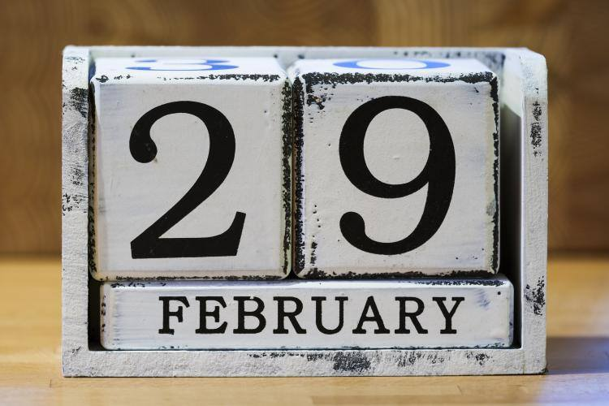

**36/365** Odată la aproximativ patru ani, februarie are 29 de zile, în loc de obişnuitele 28. Anul bisect a apărut datorită desincronizării calendarului Gregorian cu rotaţia Pământului. O rotaţie completă în jurul Soarelui durează 365.2422 zile. Noi însă folosim un calendar de 365 de zile. Astfel, odată la patru ani ceasurile trebuie să fie sincronizate cu timpul real. Dacă acest lucru nu s-ar face, am ajunge să sărbătorim sărbătorile de iarnă în mijloc de vară.

