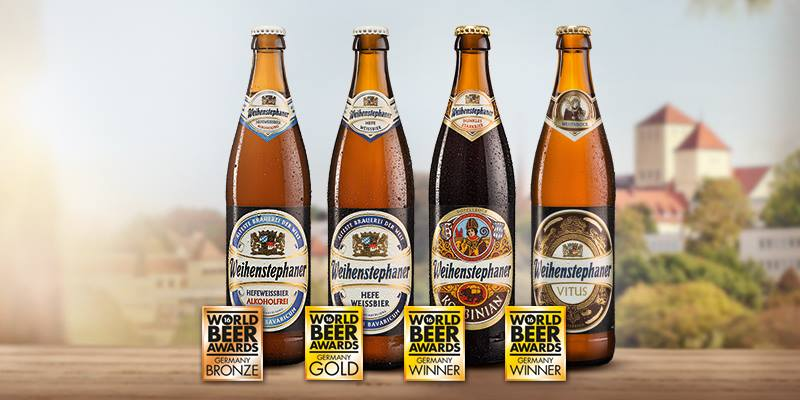

**37/365** Cea mai veche fabrică de bere existentă şi funcţională până la ziua de azi se află în Freising, Germania şi a fost construită tocmai în anul 1040. Totuşi unele dovezi indică faptul că producţia berii a început în anul 768, iar berăria a fost fondată oficial câteva secole mai târziu. Berăria Weihenstephan a fost fondată de călugării benedictini, iar în incinta acestia s-au dezvoltat unele din cele mai cunoscute centre de cercetare şi învăţământ din industria berii, unde până în prezent vin să se specializeze berarii lumii. La moment, berăria este sub tutela statului bavarez şi un adevărat simbol al culturii şi istoriei bavareze.

