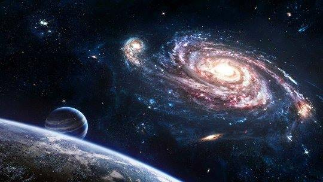

**38/365 Anul lumină** este unitatea de măsură a distanţei parcurse de o rază de lumină prin vid timp de un an iulian, ceea ce reprezintă o distanţă uriaşi de circa 9500 miliarde de km. Spre exemplu, cea mai apropiată stea, Proxima Centaur, se află la 4.22 ani lumină depărtare de pământ, astfel, toate observaţiile care sunt efectuate de pe pământ cu un telescop, reprezintă steaua cum aceasta arăta în trecut. De fapt, tot ceea ce vedem pe bolta cerească, reprezintă universul din trecutul mai puţin sau mai mult îndepărtat. Universul este într-atât de mare, încât fără definiţia de ani lumină ar fi dificil să se estimeze şi să se măsoare distanţele. Doar diametrul galaxiei noastre este estimat la 100.000 ani lumină, un număr greu de imaginat în km.

