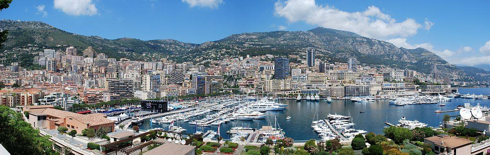

**39/365** Fiind a doua cea mai mică ţară din lume, **Monaco** totodată e şi cea mai dens populată. Cu o suprafaţă de doar 2.02km2, Monaco are o populaţie de aproximativ 37.800 de locuitori, dintre care peste 30% sunt milionari. Deşi mică ca teritoriu, Monaco este o ţară bine cunoscută, mai ales datorită cazinourilor sale, dar şi ca gazdă a campionatului Formula 1. Potrivit CIA World Factbook, Monaco are cea mai mică rată a sărăciei din lume, şi cel mai mare număr de milionari şi miliardari pe cap de locuitori. Totodată, Monaco are şi cea mai scumpă piaţă imobiliară din lume - cca 58.000$ pentru un metru pătrat! Cea mai importantă sursă de venit este turismul, turiştii fiind atraşi de cazinouri care nu pot fi însă vizitate de localnici. Monaco este şi un important centru bancar, deţinând fonduri de peste 100 de miliarde de euro. Limba oficială a ţării este franceza, dar se vorbeşte şi italiana şi engleza. Limba monegasca astăzi este vorbită de o minoritate de rezidenţi. Interesant, dar şi logic, este faptul că din cauza teritoriului mic, Monaco nu are niciun aeroport.

