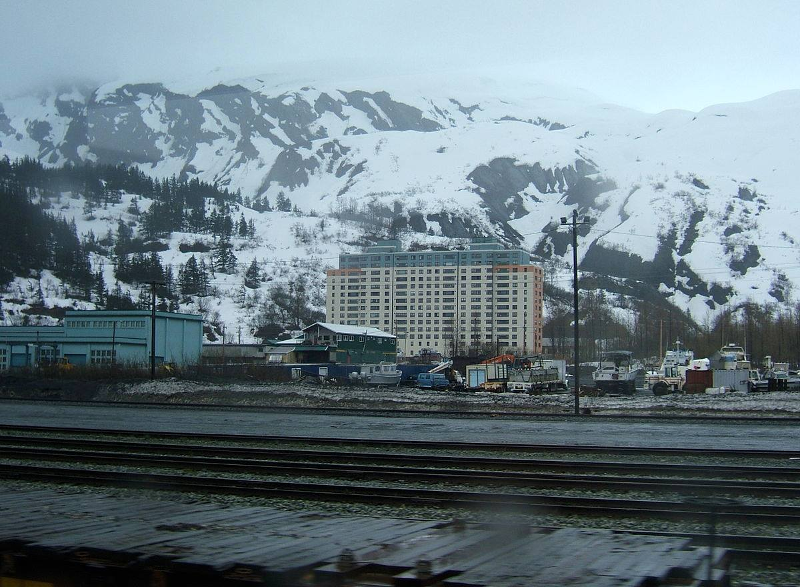

**4/365** Toată populaţia oraşului Whittier, situat în statul american Alaska, locuieşte într-o clădire cu 14 etaje construită în anul 1956! Conform datelor din 2015, în oraş locuiesc 214 persoane. În aceeaşi clădire, există un sector de poliţie, şcoală, spital, o biserică, cafenea şi magazine. Suprafaţa totală a oraşului este de 51km2.

