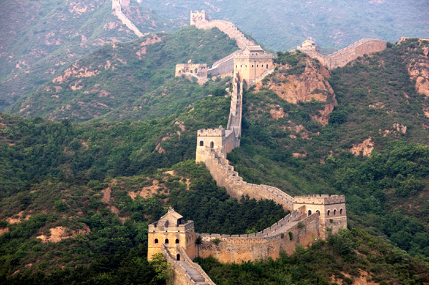

**40/365** Construit pentru a apăra China de popoarele nomade, **Marele Zid Chinezesc** are peste 21.000km lungime, o lungimă pur şi simplu enormă, dacă luăm în calcul şi faptul că a fost contruit cu câteva mii de ani în urmă, atunci când omenirea nu dispunea de instrumentele moderne din zilele noastre. Prima porţiune a zidului a fost construită tocmai în secolul V î.e.n., iar în timpul domnirii dinastiei Ming (1368 – 1644), acesta a ajuns la lungimea sa maximă. Grosimea acestuia diferă de la 4 la 10 metri, iar la câteva sute de metri erau construite turnuri de veghe, cca 25.000 la număr, în care, în caz de pericol, se făcea focul pentru a transmite semnale celorlalţi. Pe aproape tot parcursul existenţei sale, zidul a fost reconstruit, însă mai puţin în ultimul timp, din cauza că acesta nu mai poate servi drept zid de apărare, iar în anul 1952 a fost luat sub protecţie guvernamentală şi declarat monument istoric. Totuşi, doar o mică parte a zidului este deschisă pentru turişti şi reabilitată. Unul din miturile legate de zid, este acela că acesta s-ar face văzut tocmai de pe Lună, deşi echipajele spaţiale spun că Marele Zid nu este vizibil nici măcar de pe orbită.

