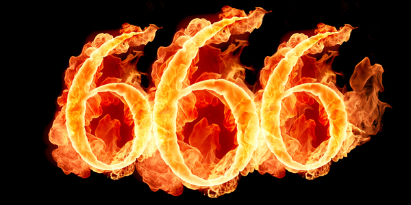

**41/365 Hexakosioihexekontahexafobia** nu este un cuvânt scris la întâmplare de o pisică care s-a plimabat pe tastatura calculatorului, ci frica de numărul 666 care își are originea în versetul biblic 13:18 din Cartea Apocalipsei, care spune că acest număr este asociat cu Satana sau cu Antihristul.

