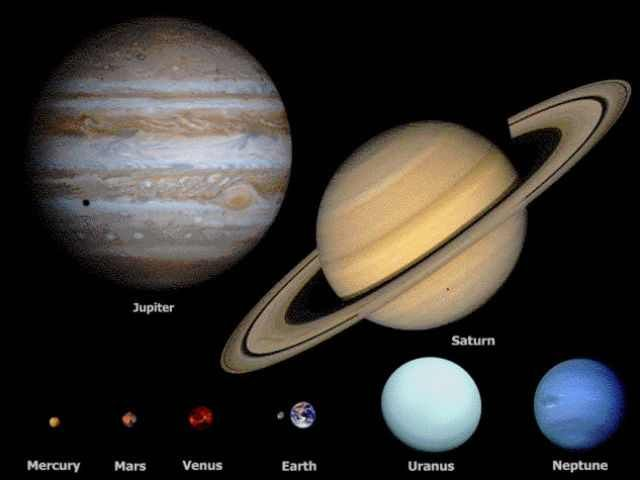

**42/365** Jupiter este a cincea planetă de la Soare şi cea mai mare planetă din sistemul solar, cu un diametru de 11 ori mai mare decât al planetei Pământ, cu o masă de 318 ori mai mare şi cu un volm de peste 1300 de ori mai mare. Totuşi, **perioada de rotaţie** în jurul axei sale a acestei planete **este de doar 9 ore şi 55 minute**, datorită vitezei sale de rotire mult mai mare ca a Pământului. Astfel, dacă viteza de rotire în jurul axei sale a Pământului este de 1.673km/h (40.075km circumferinţa la eucator), pe Jupiter această viteză este egală cu 14.300km (142.984km circumferinţa la eucator). Totuşi, perioada orbitală a Jupiterului, din cauza distanţei acestuia de la Soare (cca. 778.5 milioane de km), este de 11,8 ani sau 4332 de zile, iar a pământului de cca 365de zile.

