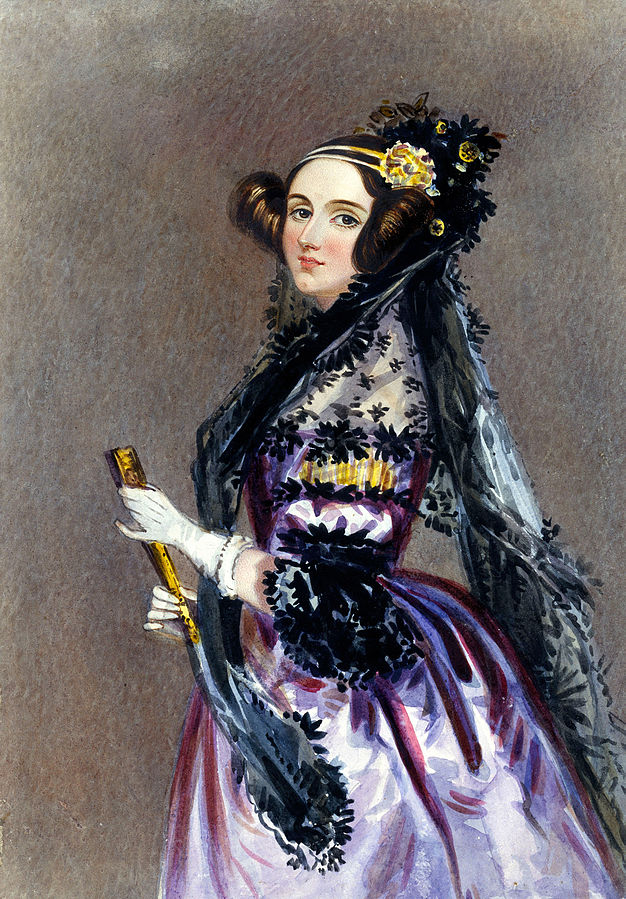

**43/365** Deşi în domeniul IT, majoritatea dezvoltatorilor sunt bărbaţi, totuşi, primul limbaj de programare a fost creat de o femeie, tocmai în anii 1840. **Ada Lovelace**, fiica scriitorului Lord Byron, s-a născut la 10 decembrie 1852, la Londra. Pe parcursul scurtei sale vieţi, Ada a fost pasionată de cercetările ştiinţifice, iar ceea ce avea să fie mai târziu numit primul limbaj de programare şi prima programă scrisă pentru un calculator, au fost notiţele sale la traducerea unui articol al matematicianului italian Luigi Menabrea, despre mașinăria lui Charles Babbage, numită "Motorul analitic". Notiţele erau practic de trei ori mai mari decât însuşi articolul, şi explicau în cel fel maşina era diferită de maşina diferenţială, proiectată de Charles Babbage, dar care a fost construită doar în 2002, la Londra. Astfel, Ada a reuşit să scrie un limbaj de programare şi un program pentru o maşină de calcul care exista doar pe hârtie, iar în 1975, în semn de respect pentru munca Adei Lovelace, Departamentul Apărării al SUA a luat decizia de a crea un limbaj de programare numit în cinstea ei. A murit la vârsta de doar 36 de ani, exact atâta cât a trăit şi tatăl ei, şi a fost îngropată lângă el, la cerinţa Adei.

