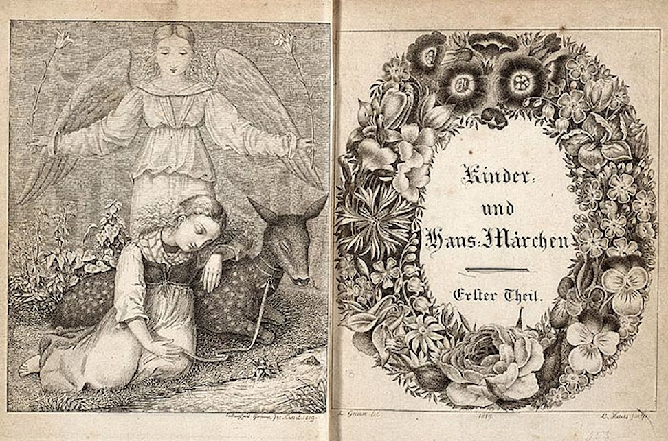

**45/365** Istoria cunoaşte nenumărate istorii despre oameni de vază şi genii a căror valoare a fost descoperită fie peste ani, în cel mai bun caz, fie după moartea acestora. Se pare că nici **fraţii Grimm** nu au avut altă soartă.
La 21 decembrie 1812 Jacob și Wilhelm Grimm, de 27 şi respectiv 26 de ani tocmai primiseră de la tipografie 900 de exemplare ale operei lor de debut - culegerea Kinderund Hausmärchen („Povești pentru copii și familie”). Era rezultatul unei munci de ani de zile! Deşi vânzările au mers bine chiar de la început, nici criticile nu au întârzia să apară. "Culegerea are doar porcării în ea", scria un ziarist. Totuşi, întrebarea pe care şi-o puneau mulţi era: cui de fapt sunt adresate aceste poveşti, copiilor sau adulţilor? Textele fraţilor Grimm erau provocatoare pentru burghezia secolului XIX. Spre exemplu, în povestea despre Rapunzel, frumoasa tânără este închisă într-un turn de către o vrăjitoare, iar ea îşi coboară părul lung pentru a-l ajuta pe prinţ să urce sus, unde imediat ce ajunge, întreţine relaţii, iar prinţesa rămâne însărcinată. În Albă-ca-Zăpada, însuşi mama ei dă ordin ca aceasta să fie ademenită în pădure și omorâtă. Totuşi, printesa își duce la bun sfârșit răzbunarea și își obligă mama să danseze până la moarte încălțată în botine din fier încins. În altă poveste, o femeie îşi decapitează fiul vitreg şi apoi îl găteşte şi i-l dă de mâncare soţului.
Jacob și Wilhelm proveneau dintr-o familie cu mulți copii, iar la 11 ani, le-a murit tatăl. Au reuşit totuşi să intre la un liceu prestigios din Kassel, acolo unde cei doi au împărțit o cameră și au devenit mai inseparabili ca oricând. După liceu, care l-au absolvit pe locul I, aceştia îşi continuă educaţia la universitatea din Marburg, unde aveau să-l cunoască pe profesorul Friederich von Savigny, care i-a îndrumat să studieze literatura medievală germană. La acel moment, Germania era alcătuită din circa 200 de ducate, fraţii Grimm au devenit parte din mişcarea care avea ca scop unificarea naţiuniim iar pentru aceasta, se credea că cercetătorii aveau obligaţia de a investiga rădăcinile poporui, limba şi literatura originară. Fraţii Grimm s-au dedicat acestei investigaţii cu pasiune, şi s-au specificat în culesul folclorului. Atunci când a fost publicată cartea lor, mama fraţilor murise, astfel cei doi erau responsabili pentru întreţinerea familiei, şi poate din acel motiv, Wilhem, s-a apucat să prelucreze poveştile, probabil influenţat de critici - aluziile sexuale au fost înăbuşite, iar stilul naraţiunii a devenit mai atractiv. Totuşi, violenţa a rămas în basme, iar în unele cazuri a fost accentuată.
Pentru ca poveştile să fie mai atractive, aceştia au recurs şi la ilustrarea lor, astfel în 1825 a fost editată o versiune specială, cu cele mai cunoscute 50 de poveşti.
Foarte curând fraţii Grimm au cucerit lumea întreagă, iar Charles Dickens povestea cât de captivat era de basmele memorabile. Dacă inițial frații Grimm și-au dorit să facă o muncă de cercetare, totuşi, au abandonat parțial ideea pentru a fi și pe gustul publicului.
Jacob și Wilhem Grimm au murit la 78, respectiv 73 de ani. Și-au încheiat zilele în celebritate, care a dăinuit până în ziua de azi, când găsim basmele lor traduse în mai bine de 160 de limbi.

Inspirat din http://www.historia.ro/exclusiv_web/general/articol/pove-tile-fra-ilor-grimm-au-iscat-scandal-c-nd-au-fost-publicate-prima

