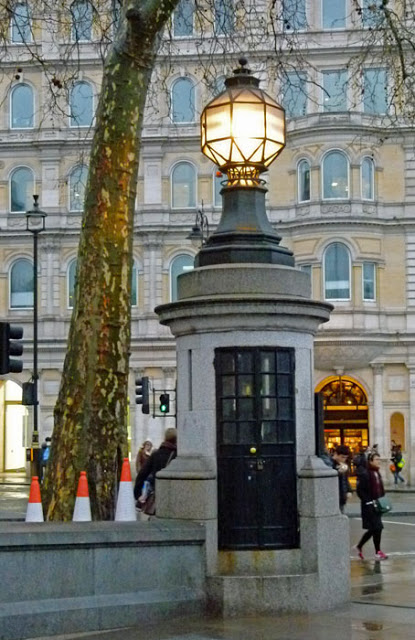

**46/365** Unul din nenumăratele simboluri ale Londrei, este şi **cea mai mică secţie de poliţie din lume**, care se află în partea de sud-est a Trafalgar Square. Secţia este atât de mică, că permite încarcerarea a doar două persoane, iar iniţial a fost construită pentru a permite doar unui singur ofiţer de poliţie să lucreze în ea. Totuşi, în zilele noastre, această secţie nu mai este funcţională.

