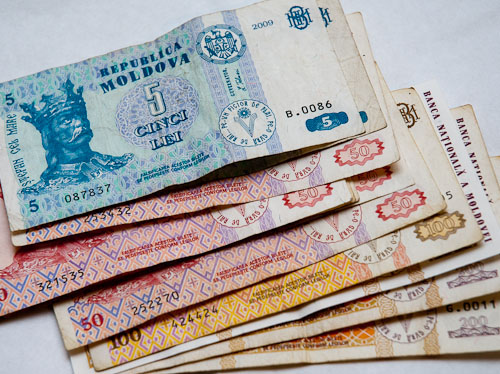

**47/365** În secolul al XVII-lea, în principatele dunărene se foloseau ca monedă talerii olandezi, löwenthaler, pe care erau reprezentaţi un leu, iar locuitorii numeau moneda pur şi simplu leu. Chiar şi după ce talerul fuseseră scos din uz, în a doua jumătate a secolului XVIII-lea, oamenii încă mai foloseasu denumirea de leu, exact cum până în ziua de azi, moldovenii folosesc deseori cuvintele "rublă" sau "copeici" în discuţii, deşi această valută nu mai este în folosinţă de peste 20 de ani.
La 16 decembrie 1835, **leul** devine moneda oficială a românilor, instituită de domnul Ţării Româneşti - Alexandru Ghica. Iniţial, aceasta era o unitate teoretică de cont, care echivala cu 60 de parale. Toate taxele, impozitele, tranzacţiile se calculau în lei, dar erau achitate în valută străină.
În anul 1859, Alexandru Ioan Cuza negociează baterea unor monede româneşti la Paris. Acestea urmau să se numească - români, şi urmau să cântărească cinci grame de argint. În 1860 şi 1864 se bat câteva monede de probă, dar acestea nu au fost puse în circulaţie niciodată.
La 22 aprilie 1867 este stabilită moneda naţională - leul. O monedă bimetalică cu etalonul la 5 grame de argint sau 0,3226 grame de aur şi având 100 de diviziuni, numite bani. Un leu echivala cu un franc francez. Monedelele de 5, 10 şi 20 de lei erau din aur, iar cele de 1 şi 2 lei, precum şi cele de 50 de bani erau din argint. Până la înfiinţarea Monetăriei statului (1870), primele monede au fost bătute la Birmingham, Marea Britanie.
Începând cu anul 1872 s-au bătut monede de 50 de bani, 1 leu și 2 lei fără ca imperiul Austro-Ungar să mai protesteze.
După căderea Uniunii Sovietice, bancnota naţională a Republicii Moldova devine leul.

Inspirta şi informat din articolul dat http://www.identitatea.ro/leul-implineste-180-ani-unde-vine-denumirea-leu/

