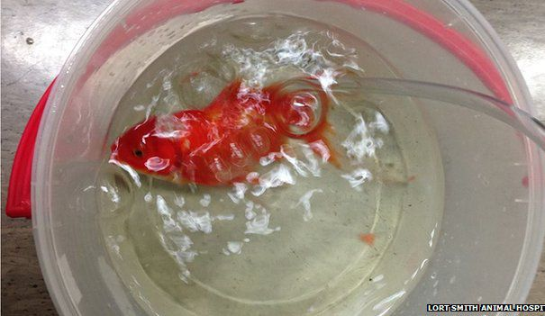

**48/365** În timp ce în unele ţări nivelul medicinei e practic la pământ, în alte ţări, chiar şi peştii de acvariu au parte de tratamente de calitate. Astfel, în anul 2014, în Australia, un peştişor care avea o tumoare pe creier, care îi punea viaţa în pericol, a fost operat. Stăpânul acestuia avea de ales, fie să-şi opereze prietenul necuvântător, fie pur şi simplu să-l omoare. Totuşi, stăpânul a ales prima variantă, pentru care a achitat 200 de dolari, iar peştişorul în vârstă de 10 ani a fost operat timp de 40 de minute, şi acum este în afara oricărui pericol.

