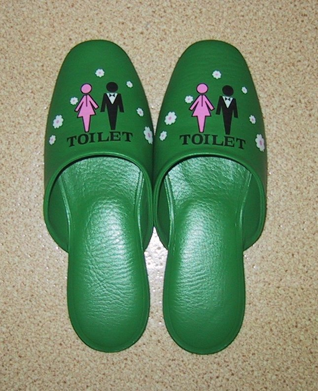

**49/365** Cultura japoneză face diferenţă între zonele curate şi murdare. Astfel, înainte de a intra în casă, aceştia îşi schimbă încălţămintea pe care o poartă afară cu cea pentru casă. Totuşi, zona "murdară" este consideretă şi toaleta. Astfel, pentru a minimiza contactul zonei murdare cu cea curată, japonezii folosesc **şlapi de toaletă**. Interesant este faptul că inclusiv unele toalete publice folosesc încălţăminte specială, care se găseşte imediat după uşă.

