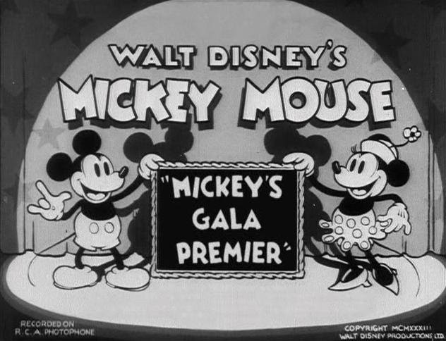

**5/365** Cea mai lungă pauză la TV a avut loc între 1 septembrie 1939 şi 7 iunie 1946 la postul de televiziune BBC. În momentul în care emisia a fost întreruptă, BBC difuza desenul animat Mickey Mouse, iar difuzarea acestuia a fost reluată peste aproape şapte ani, atunci când televiziunea postului BBC şi-a reînceput activitatea. Desenul animat a continuat exact din momentul în care fusese întrerupt cu mult timp în urmă, şi nimeni nu cunoaşte câţi dintre cei care au fost martorii scenei din 1 septembrie 1939 au văzut continuarea şapte ani mai târziu.

