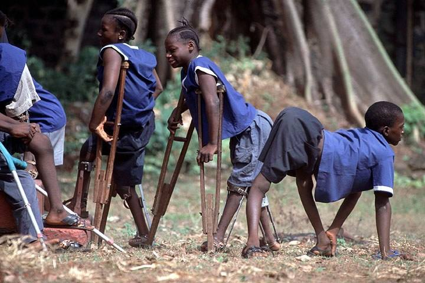

**51/365 Poliomielita**, adesea denumită și paralizie infantilă, este o boală infecțioasă virală acută, care se răspândește de la om la om, de obicei pe cale fecal-orală. În aproximativ 1% dintre cazuri virusul pătrunde în sistemul nervos central, infectând și distrugând preferențial neuronii motori, având ca efect slăbiciune musculară și paralizie flască. În funcție de nervii implicați pot să apară diferite tipuri de paralizie. Poliomielita coloanei vertebrale este forma cea mai comună caracterizată prin paralizie asimetrică, care de cele mai multe ori implică picioarele. Poliomielita bulbară are ca efect slăbiciunea mușchilor care sunt inervați de nervi cranieni.

Poliomielita a fost recunoscută ca o boală distinctă în 1840 de Jakob Heine. Agentul care o provoacă este poliovirusul, a fost definit în 1908 de Karl Landsteiner. Deși epidemiile majore de poliomielită erau necunoscute până la sfârșitul secolului al 19-lea, poliomielita a devenit una din cele mai temute boli de copilărie al secolului al 20-lea. Epidemiile de poliomielită au mutilat mii de oameni, majoritatea copii mici, boala a cauzat paralizie și moarte. Poliomielita a existat pentru mii de ani în mod latent ca patogenie endemică până în anii 1880 când în Europa a început o epidemie mare care s-a întins apoi și în Statele Unite ale Americii. Prin 1910, o mare parte a lumii a cunoscut o creștere dramatică a cazurilor de poliomielită și epidemiile frecvente au devenit evenimente regulate, în principal în orașe, în timpul lunilor de vară. Aceste epidemii care au lăsat mii de copii și adulți paralizați a dat un impuls pentru o "Mare Cursă", în vederea dezvoltării unui vaccin pentru poliomielită. Poliomielita a atins un prag superior în Statele Unite în 1952, cu peste 21.000 de cazuri de paralizie. Cu toate acestea, după introducerea vaccinurilor eficiente, incidenţa poliomielitei a scăzut rapid. Ultimul caz de poliomielită cu virus sălbatic din Statele Unite a fost inregistrat în 1979, iar în următorii 10 ani se poate atinge eradicarea globala a poliomielitei.

Sursa: wikipedia.com, csid.ro

