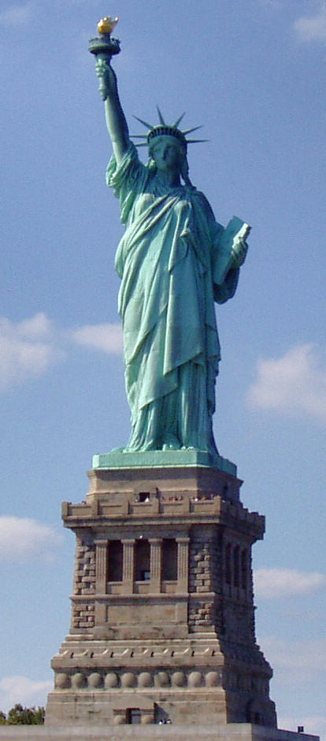
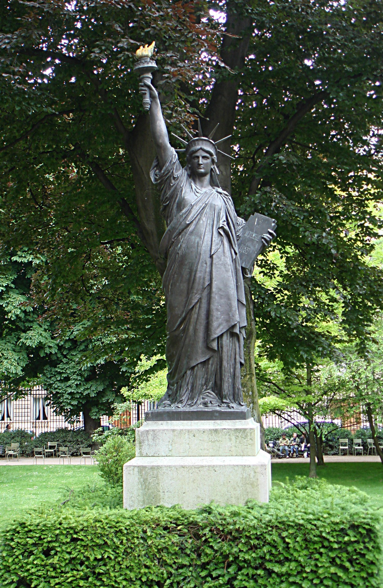

**52/365 Statuia Libertăţii**, simbolul Statelor Unite al Americii, plasată pe Insula Libertăţii în anul 1886, a fost cadoul Franţei cu ocazia aniversării a 100 de ani de la câştigarea independenţei a SUA. Greutatea statuii este de 225 tone, înălţimea acestia (fără postament) constituie 46.5m, iar culoarea, datorită oxidării cuprlui, este verde. În interiorul postamentul se află un muzeu, iar pe tăbliţa care este ţinută în mână de Zeiţă, a fost gravată data 4 iulie 1776 - data când a fost ratificată Declaraţia de independenţă a SUA. Scheletul metalic al statuii a fost proiectat de Gustave Eifel, inginerul structural şi constructorul Turnului Eifel. Primul model, turnat la scară mică, a fost realizat în anul 1870 şi se află în grădina Luxembourg din Paris.

Sursa: wikipedia.com

