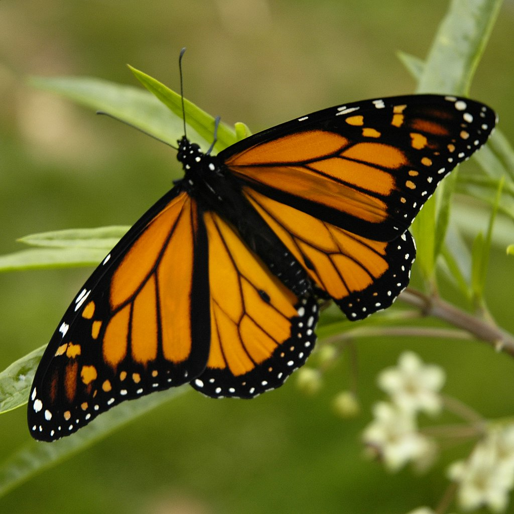

**53/365** Durata vieţii unui fluture diferă foarte mult de la specie la specie. Astfel, în timp ce viaţa unor fluturi poate să dureze doar câteva ore, alţii pot trăi până la un an. **Fluturele Monarh** parcurge o distanţă de 4.000km în doar opt săptămâni din America de Nord, SUA la hotare cu Canada, până în Mexic. Fluturele Monarh care are doar circa 10cm în lăţime, parcurge aproximativ 70km/zi, iar în tot acest timp se hrăneşte cu nectarul florilor de câmp. Până la acest moment, migraţia acestor fluturi rămâne o enigmă pentru oamenii de ştiinţă.

