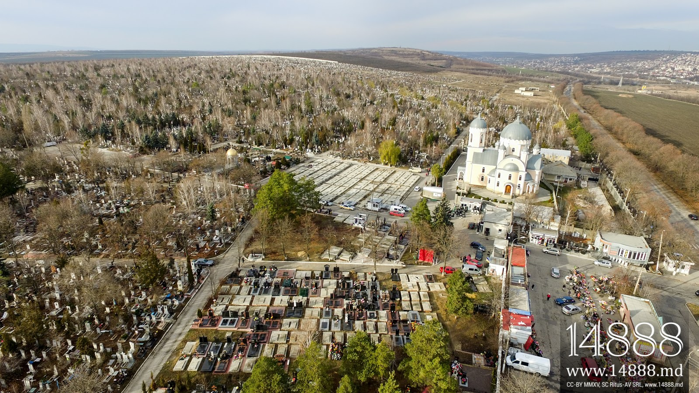

**54/365** Cel mai mare cimitir din Europa, cu o suprafaţă de peste două milioane de metri pătraţi se află la Chişinău şi "găzduieşte" peste 300.000 de morminte, dintre care peste 600 sunt cavouri. Anual, la cimitirul **Sfântul Lazăr** sunt îngropaţi între 4.000 şi 5.000 de decedaţi. O parte din cimitir este proprietatea Germaniei şi găzduieşte rămăşiţele soldaţilor germani căzuţi în cel de-al Doilea Război Mondial. Totodată, în cimitir sunt îngropaţi peste 10.000 de evrei.

