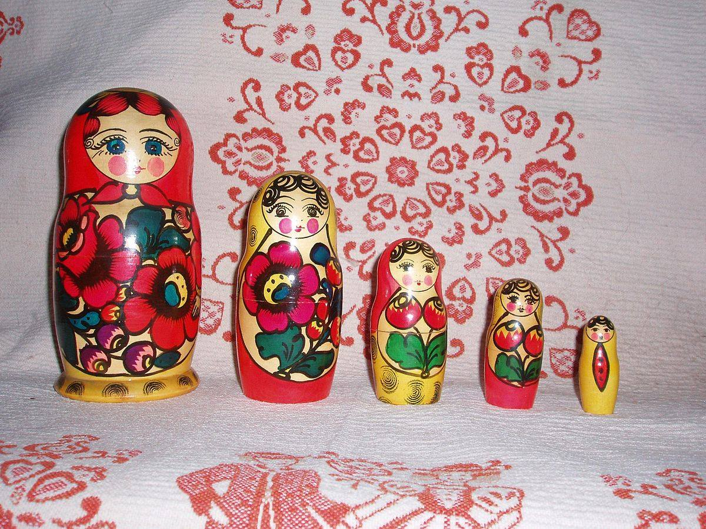
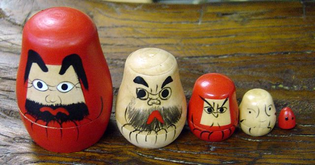

**55/365** Arhicunoscută ca parte a culturii ruse, Matrioşka a fost inspirată de la japonezi, de la o păpuşă asemănătoare care îl reprezenta pe Zeul Fukumura. Păpuşa japoneză era alcutăuită din cinci părţi care intrau una în alta. La sfârşitul secolului al 19-lea, pictorul rus Serghei Maliutin a fost inspirat de una din acele jucării aduse de pe insula Honshu, Japonia. Acesta a pictat cele cinci figurine începând cu o fată de ţăran cu un cocş negru în braţe, şi terminând cu un copil în faşă. Astăzi, Matrioşka însă reprezintă o mulţime de personalităţi politice, staruri de cinema, ş.a.

