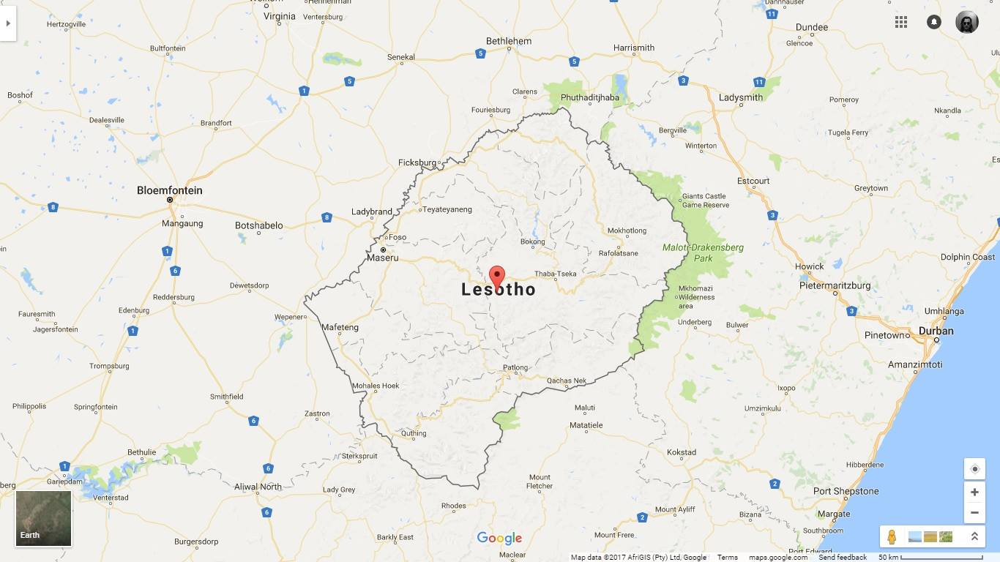

**56/365 Enclava** este un stat înconjurat în totalitate doar de alt stat. Deşi cândva acestea erau destul de populare în Europa medievală, la ziua de azi există doar trei state enclave în lume - Lesotho, San Marino şi Vatican. Lesotho este o ţară un pic mai mică ca Moldova, şi este înconjurată în totalite de Africa de Sud. San Marino şi Vatican sunt oraşe state ambele aflate în Italia, având o suprafaţă de 60km2 şi respectiv 0.44km2.

