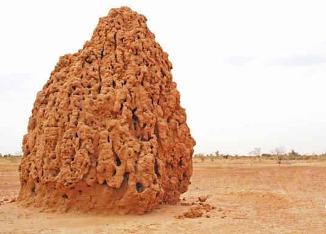

**57/365** Din vietăţile care găzduiesc planeta Pământ, imediat după om, **termitele** construiesc cele mai mari edificii în raport cu propria lor mărime şi greutate. Astfel, termitele care ajung să aibă până la 10cm în lungime, reuşesc să construiască turnuri înalte de până la 7.5m şi cu un diametru de până la 12m. O astfel de construcţie poate cântări câteva sute de tone! Totuşi, se pare că aceasta e doar vârful aisbergului, partea edificiilor care se află sub pământ poate ajunge până la 70m adâncime, iar lungimea coridoarelor poate atinge kilometri întregi! Construcţiile acestora sunt dotate cu un sistem de canalizare, ventilare şi aer condiţionat, iar temperatura în interior este menţinută la +30C.

