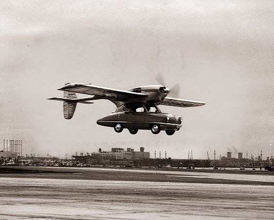

**58/365** La 1 noiembrie 1947, prototipul **Convair Model 118 ConvAirCar**, un hibrid maşină-avion efectuează primul zbor de testare cu succes care a durat mai bine de o oră. Acesta era construit din fibre de sticlă şi cântărea 330kg şi putea fi condus ca o simplă maşină. Totuşi, în orice automobil se poate termina combustibilul, fapt care s-a întâmplat la cea de a treia încercare, hibridul prăbuşindu-se. Din fericire, pilotul a rămas în viaţă, însă nu şi proiectul.

