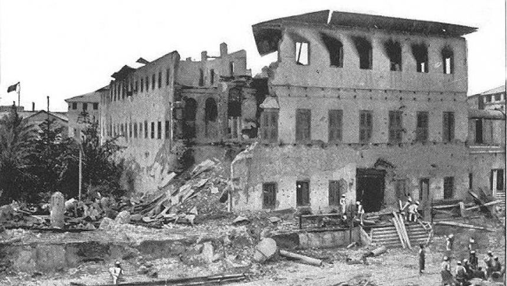

**59/365** De-a lungul istoriei, războaiele au distrus viaţa a sute de milioane de oameni. Totuşi, unele dintre războaie au fost destul de stranii. Unul din ele a fost un conflict dintre Marea Britanie şi Zanzibar, la 27 august 1896, şi a durat doar 38 de minute. Cauza acestui război a fost succesiunea la tron a sultanului local Khamad bin Thuwaini. În concordanţă cu un tratat semnat în 1886, o condiţie a ajungerii la tron era obţinerea acceptului consulului britanic. Khalid însă nu a întrunit această condiţie, şi chiar era considerat un pericol pentru siguranţa dominaţiei engleze. Astfel, britanicii au trimis un ultimatum, iar Khalid nu l-a acceptat şi a ordonat gărzilor sale să se baricadeze. Ultimatumul a expirat la orele 9:00, iar marina britanică a atacat palatul regal. Supus unui bombardament intens, palatul a căzut rapid, Khalid a capitulat, iar numărul victimelor s-a ridicat la peste 500 de victime din armata sultanului şi doar cu un singur rănit din armata britanicilor.

