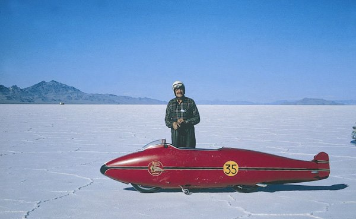

**6/365** La 26 august 1967, Herbert J. "Burt" Munro, stabileşte recordul de viteză pentru motociclete cu motorul volumul cărora nu depăşeşte 1000cc. Timp de mai bine de 25 de ani, Burt Munro a modificat o motocicletă "Indian" produsă în anul 1920, folosind doar piese produse de el însuşi. Recordul de viteză înregistrat oficial este de 295,44km/h, iar în timpul rundei de calificare, viteza maximă atinsă a fost 331,52km/h. La începutul anului 2017, la aproape 50 de ani de la evenimentul din Bonneville Salt Flats, recordul stabilit de Burt încă nu a fost bătut!
În 2005, la aproape 30 de ani de la moartea recordsmenului, în Noua Zeelandă a fost lansat filmul biografic "The world's fastest Indian" cu Anthony Hopkins în rolul principal.

