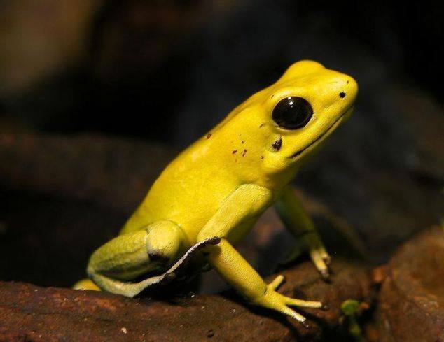

**60/365** Deşi e micuţă şi drăgălaşă, această broscuţă pare să fie cea mai otrăvtioare vietate de pe planeta Pământ. Se pare că aceasta poate depozita otravă pentru a omorî între 10 şi 20 de oameni. Doza letală pentru un singur om, e de aproximativ 200 de micrograme. Este într-atât de otrăvitoare, încât se cunosc numeroase cazuri de victime omeneşti, iar unele animale au devenit victimă doar din cauza că păşiseră pe urmele proaspete ale acestor broscuţe. **Broasca săgeată** aurie (Phyllobates teribilis) se întâlneşte în junglele Columbiei şi formează grupuri din 5-6 indivizi. Pot atinge lungimea de cca 45mm, iar culoarea pielii variază între galben, portocaliu sau verde, în dependenţă de zona unde au fost întâlnite. Datorită otrăvii sale puternici, în lumea animală există doar un singur şarpe care o atacă, acesta dezvoltându-şi de-a lungul timpului imunitate.

