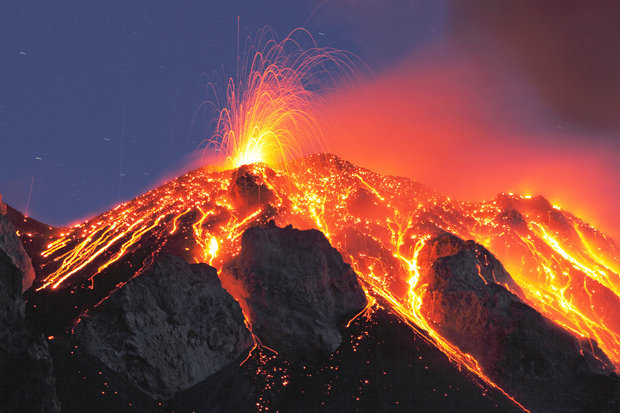

**61/365** La 24 august 79, după un cutremur violent, Vezuviul a erupt, iar un nor uriaş de fum se ridica peste munte. Pe străzile oraşului Pompei au început să caudă pietre încinse, iar mai apoi cenuşa care a orbit şi a sufocat oamenii. Totul s-a petrecut atât de repede, încât lumea pur şi simplu nu a reuşit să fugă. Pe pantele muntelui s-au prelins gaze toxice, astfel că oamenii mureau sufocaţi în doar câteva minute. La doar câteva ore, tot oraşul se afla deja sub câţiva metră de cenuşă. Puţini oameni reuşiseră să se salveze, iar oraşul **Pompei**, împreună cu câteva mii de locuitori, pur şi simplu a dispărut. Datorită faptului că oraşul a fost sub cenuşă şi a fost descoperit doar peste mai bine de 1500 de ani, s-au păstrat casele, iar la intrarea în una din ele, se poate vedea şi astăzi o tăbliţă pe care scria "Atenţie, câine rău".

