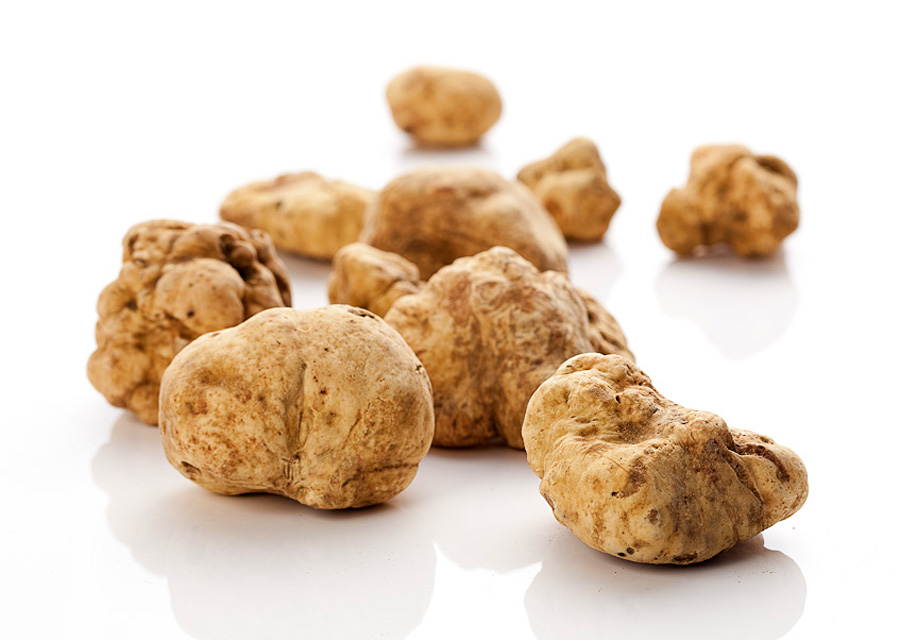

**62/365** Dacă sunteţi mari amatori de ciuperci şi aţi dori să încercaţi trufele, atunci trebuie să fiţi gata să cheltuiţi sume uriaşe de bani! Spre exemplu, la 8 noiembrie 2009, în cadrul celui de al 79-lea Festival al Trufelor Albe, o ciupercă cu greutatea de 800 grame a fost vândută la suma de 150.000$. Trufele din specia Tuber Magunm de obicei se vând la preţul de 10.200 lire per kilogram. Totuşi, nu toate speciile au o mare valoare gastronimică. Acestea de obicei cresc în păduri sub straturi de frunze şi sunt căutate cu ajutorul porcilor sau a câinilor dresaţi.

