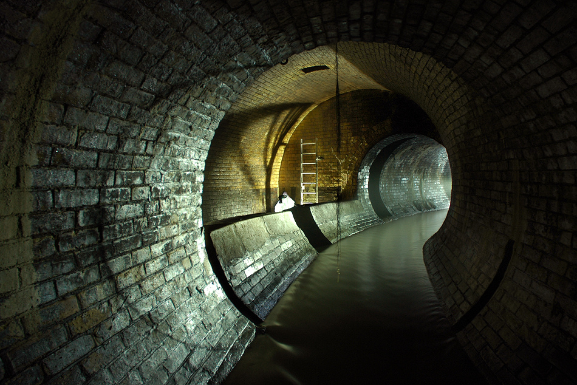

**63/365** Odată cu creşterea populaţiei, Londra trebuia să rezolve problema salubrizării oraşului. În secolul 19, toate apele colectate erau vărsate direct în Tamisa, iar apa a început să miroase din ce în ce mai rău, până când în anul 1858 s-a declanşat "Marea Duhoare" (The Great Stink). Apa de băut, provenea la fel din Tamisa, şi provoca boli şi epidemii. Într-un final, Parlamentul a apropbat un nou **sistem de canalizare**, iar Jospeh Bazalgette a fost însărcinat cu construcţia acestuia. Peste 2.100km de tuneluri şi ţevi au ajuns să colecteze apele reziduale şi să alimenteze populaţia cu apă potabilă. După ce sistemul a fost finisat, numărul deceselor a scăzut foarte mult, iar holera a dispărut total ca epidemie. Sistemul construit de Bazalgette este folosit şi până în ziua de astăzi.

