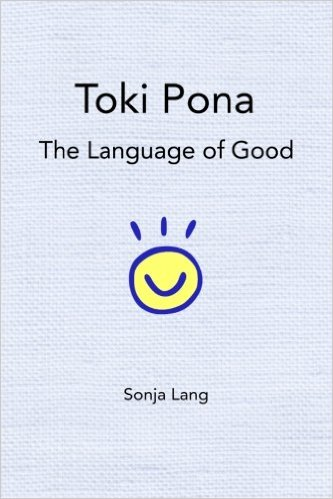

**64/365 Toki pona** estea o limbă artificială creată în 2001 de către canadiana Sonja Elen Kisa, şi conţine doar 123 de cuvinte. Sonja susţine că numărul redus de cuvinte exprimă aproape orice idee. Pentru a număra se folosesc doar trei cuvinte - wan (unu), tu (doi) şi mute (câteva), iar pentru a spune un număr dorit, oamenii trebuie să repete unu sau doi atâtea ori până ajung la numărul respectiv. Sonja spune că scopul limbei nu este de a reda calcule complexe. Denumirea acestei limbi s-ar traduce ca "limbă simplă" şi poate fi învăţată în doar câteva ore.

