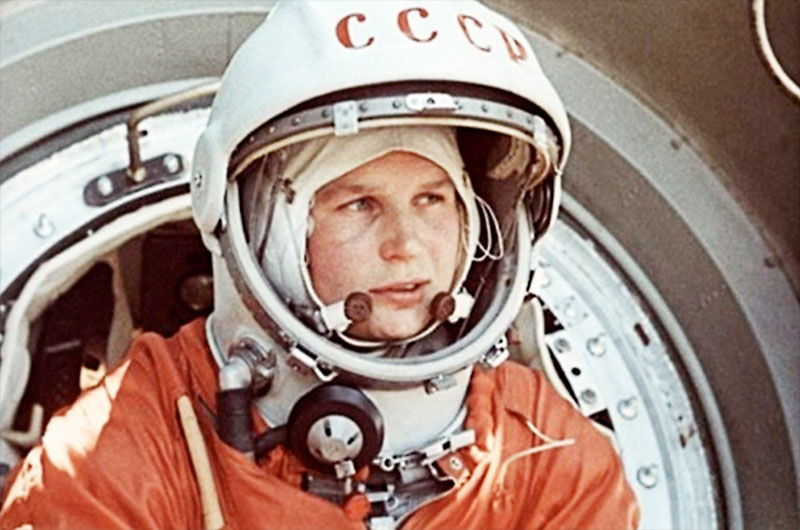

**65/365** La 6 martie 1937 s-a născut **Valetina Tereşkova**, prima femeie cosmonaut, şi unica femeie care a zburat singură în cosmos. La 16 iunie 1963, Valentina a zburat în cosmos la bordul navei Vostok 6. Aceasta s-a aflat în cosmos timp de aproape trei zile, şi între timp a reuşit să înconjoare pământul de 48 de ori, parcurgând o distanţă de 1.97 milioane de kilometri. Ea a fost aleasă dintre 50 de fete paraşutiste, cu vârsta până la 30 de ani, greutatea de până la 70kg şi înălţimea de până la 170cm. Din cele cinci fete alese pentru a se pregăti, într-un final cosmosul l-a vizitat doar ea, deşi iniţial se planifica că şi celelalte patru o să zboare mai târziu, dar n-a fost să fie. Secvenţele video cu aterizarea ei au fost trucate, din motiv că Valentina se simţea destul de rău când a aterizat, dar totuşi a doua zi, după ce a fost internată în spital, starea ei s-a îmbunătăţit. Astăzi ea a împlinit 80 de ani.

