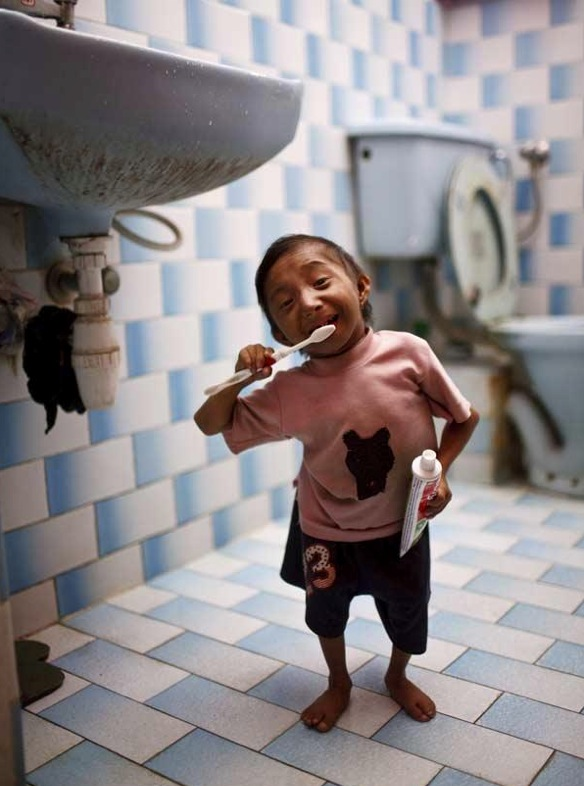

**66/365** Unul din cei mai mici oameni din lume se numeşte **Khagendra Thapa Magar** din Nepal şi are o înălţime de 60 de centimetri. La naştere, el avea înălţimea de doar 15 centimetri, iar corpul său a încetat să se mai dezvolte de la 11 ani. Khagendra a depăşit recordul deţinut anterior de chinezul He Piping, care are o înălţime de 73 centimetri, şi a deţinut recordul drept cel mai mic om pân la 13 iunie 2011 când a fost depăşit de filipinezul Junrey Balawing, care are înălţimea de 59.93cm, recordul căruia, la rândul său, a fost doborât de un alt pitic - Chandra Bahadur Dangi, care avea înălţimea 54.6cm.

