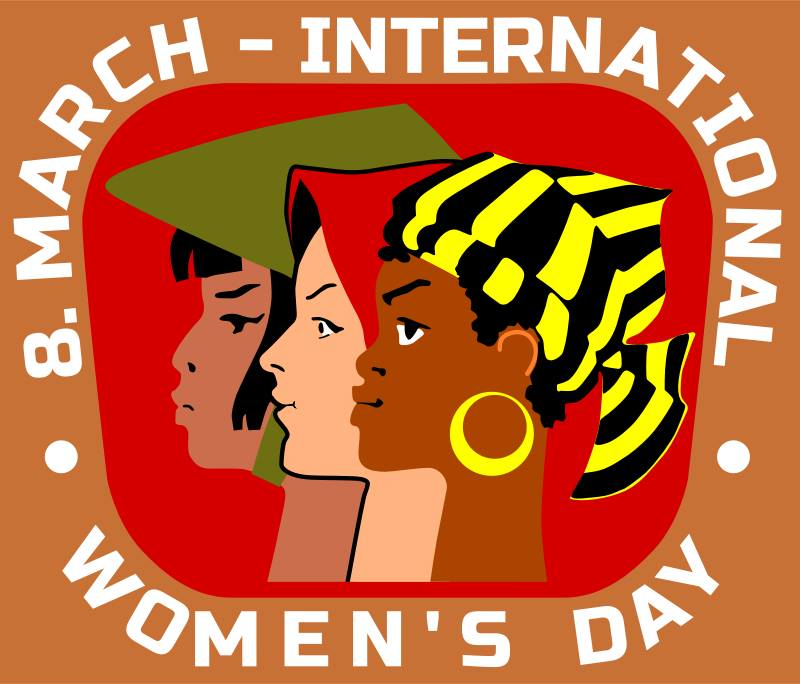

**67/365** La **8 martie** se sărbătoreşte Ziua Internaţională a Femeii. Această sărbătoare a fost adoptată în anul 1977 printr-o rezoluţie a Adunării Generale a ONU. Pentru prima dată însă, Ziua Femeii a fost sărbătorită la 28 februarie 1909 la New York, pentru a comemora o grevă a sindicatului, care avuse loc cu un an mai devreme, şi la care participaseră peste 15.000 de femei care cereau dreptul la vot, salarii mai bune şi un program de lucru mai scurt. În august, 1910, cu ocazia Internaţionalei Socialste reunite la Copenhaga, activista socialistă germană Luise Zietz împreună cu Clara Zetkin propun sărbătorirea zilei femei, însă nu au specificat o dată concretă. La 19 martie 1911, pentru prima dată se sărbătoreşte Ziua Internaţională a Femeii, iar începând cu anul 1913, femeile din Rusia, au sărbătorit Ziua Femeii în ultima duminică din luna februarie, iar în 1917, ultima duminică din februarie conform calendarului vechi a coincis cu 8 martie calendarul nou. După Revoluţia din Octombrie, Vladimir Ilici Lenin a declarat 8 martie ca sărbătoare oficială în Uniunea Sovietică, însă abia începând cu 1965 aceasta a devenit zi nelucrătoare.

