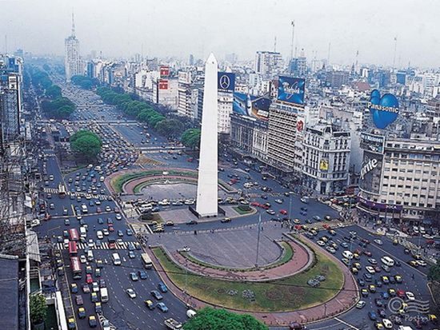

**68/365** Cea mai scurtă stradă din lume se află în Scoţia şi are doar 2.06m lungime şi o singură adresă, pe care se află intrarea în No 1 Bistro.
!!! Cine mă poate ajuta să găsesc cea mai lungă stradă din lume, sunteţi binevenit! Atenţie, cea mai lungă stradă din lume nu este Yonge Street!
Cea mai îngusă stradă, o găsim în Germania, în oraşul Reuntlingen. În cel mai îngust loc, aceasta are 31cm, iar în cel mai larg, "tocmai" 50cm.
Cea mai lată stradă se află la Buenos Aires, Argentina. Are 91m lăţime şi 12 benzi pentru automobile.
Cea mai înclinată stradă se află în Noua Zeelandă. Unghiul acesteia are o înclinaţie de 35%, la fiecare 2.86m urcaţi mai sus cu un metru.

