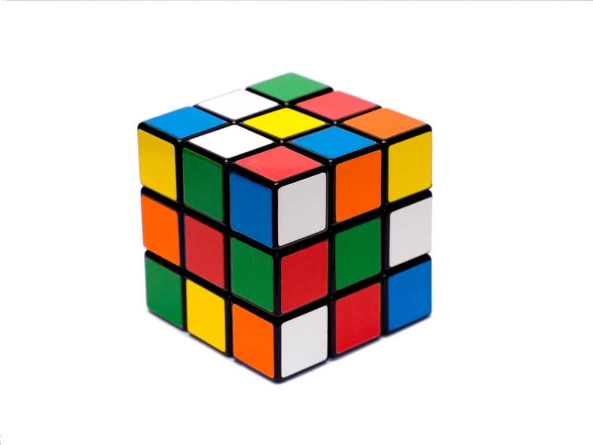

**70/365 Cubul Rubik** a fost inventat în anul 1974 de către profesorul de arhitectură maghiar Erno Rubik. Iniţial acesta purta denumirea dată de autor, Cubul Magic, însă a fost redenumit în Cubul lui Rubik de compania Ideal Toys în anul 1980. Cubul este cea mai bine vândută jucărie din istorie, cu peste 300 de milioane de exemplare (2005). Cubul Rubik are 43.252.003.274.489.856.000 posibilităţi. Dacă s-ar pune cap la cap cuburi Rubik de 57mm pentru fiecare posibilitate de mutare, şirul ar avea 261 ani lumină! Totuşi, chiar dacă numărul de posibilităţi este unul enorm, a fost demonstrat că orice combaniţie poate fi rezolvată în maxim 25 de mutări. Interesant este şi faptul că au fost publicate chiar şi cărţi cu algoritmele de rezolvare ale cubului! Recordul rezolvării cubului îi aparţine australianului Feliks Zemdegs, care a reuşit performanţa de doar 4.73 secunde!

