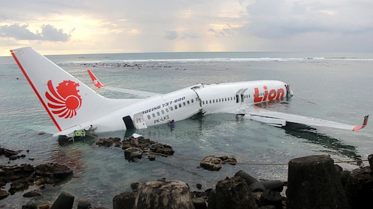

**73/365** Potrivit site-ului planecrashinfo.com, anul 1985 se pare că a fost cel mai prost pentru aviaţia mondială. În acel an, circa 2670 de persoane şi-au pierdut viaţa în urma catastrofelor aviatice, dintre care, 1105 persoane au decedat în doar trei accidente:
- Air India Flight 182 - 329 persoane;
- Japan Airlines Flight 123 - 520 persoane;
- Canada's Arrow Air Flight 1285 - 256 persoane.

Pentru comparaţie, în accidente rutiere, anual mor circa 1.3 milioane persoane, iar altele circa 20 - 50 milioane sunt rănite.

