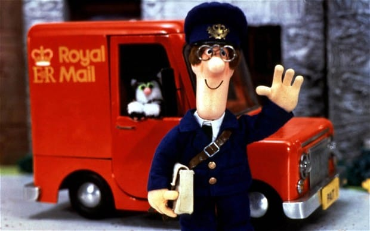

**74/365** În 2008, Janet Barrett (UK) a primit o invitaţie la o petrecere adresată lui Percy Bateman de la "Buffy" care a fost de fapt trimisă la 29 noiembrie 1919. Astfel, scrisoarea care a fost livrată de Royal Mail tocmai peste 89 de ani, poate fi pe drept considerată una "un pic" cam întârziată!

