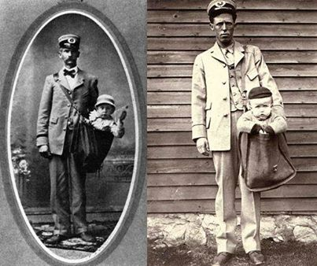

**75/365** Dacă e să continuăm tema serviciilor poştale, un fapt interesant a avut loc în anul 1913 în SUA. Părinţii şi-au trimis copilul la bunei (o milă distanţă) prin poştă şi au achitat 15 cenţi pentru servicii. Astfel de cazuri au mai fost înregistrate până în anul 1914, când poştaşii au cerut ca această practică să înceteze!

