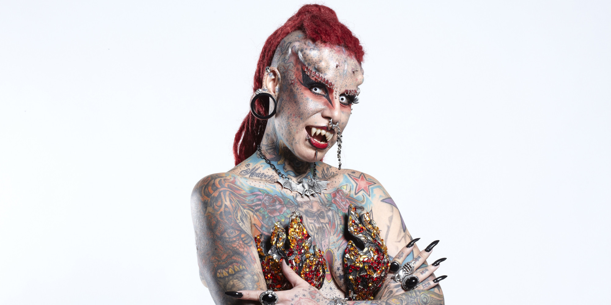

**76/365 Maria Jose Cristerna**, cunoscută ca "Mexican vampire woman", este femeia care şi-a modificat corpul în cea mai mare măsură. Aceasta şi-a modificat urechile, buzele, mâinile, ochii, fruntea, limba, buricul şi sânii. Pe lângă piercinguri, ea şi-a acoperit o parte impunătoare a corpului cu tatuaje. Maria s-a născut în anul 1976 în Mexica, are patru copii şi este avocat de profesie.

